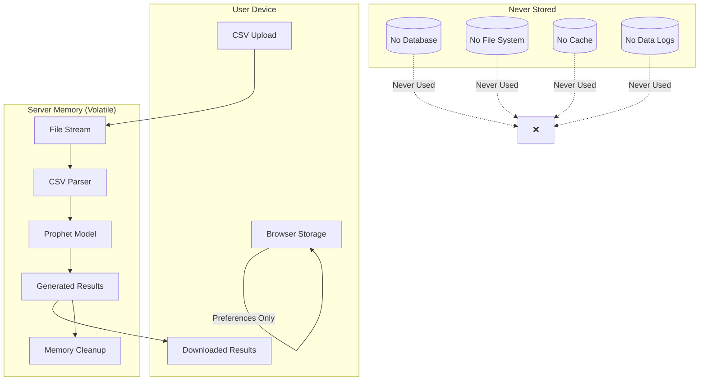

# Data Handling Documentation

## Prophet Web Interface - Technical Data Handling Guide

This document provides detailed technical information about how the Prophet Web Interface handles data throughout the entire processing lifecycle, emphasizing our privacy-first, stateless architecture.

## Architecture Overview

### Core Principle: Zero Persistence
The Prophet Web Interface operates on a **zero persistence architecture** where user data never touches any persistent storage medium. All data processing occurs entirely in volatile server memory and is immediately discarded upon completion.



## Data Processing Lifecycle

### 1. Data Upload Phase

#### File Reception
```python
# Conceptual implementation - actual code may vary
async def upload_file(file: UploadFile):
    """
    Process uploaded file directly in memory stream
    No temporary files created on disk
    """
    # Read file content directly into memory
    content = await file.read()
    
    # Parse CSV in memory using pandas
    df = pd.read_csv(io.StringIO(content.decode('utf-8')))
    
    # File content is now in memory only
    # Original file object is discarded
    del content, file
    
    return process_dataframe(df)
```

#### Data Validation
- **Format Validation**: CSV structure verified in memory
- **Column Detection**: Automatic identification of date and value columns
- **Data Quality Assessment**: Missing values, duplicates, outliers detected
- **Memory Footprint**: All validation occurs without creating copies

#### Security Measures
- **Content Scanning**: Malicious content detection in memory
- **Size Limits**: Maximum file size enforced (50MB)
- **Format Restrictions**: Only CSV files accepted
- **Encoding Detection**: Automatic character encoding detection

### 2. Session Management

#### Session Creation
```python
class SessionManager:
    def __init__(self):
        self.sessions = {}  # In-memory dictionary only
        self.max_session_age = timedelta(hours=2)
    
    def create_session(self) -> str:
        session_id = str(uuid4())
        self.sessions[session_id] = {
            'data': None,
            'created_at': datetime.now(),
            'expires_at': datetime.now() + self.max_session_age,
            'memory_usage': 0
        }
        return session_id
```

#### Session Isolation
- **Memory Separation**: Each session uses isolated memory space
- **Process Isolation**: Sessions cannot access each other's data
- **Concurrent Safety**: Thread-safe session management
- **Resource Limits**: Per-session memory limits enforced

#### Automatic Cleanup
```python
def cleanup_session(self, session_id: str):
    """
    Secure cleanup of session data with explicit memory clearing
    """
    if session_id in self.sessions:
        session = self.sessions[session_id]
        
        # Explicit data clearing
        if 'data' in session and session['data'] is not None:
            # Clear pandas DataFrame
            session['data'] = None
            
        # Clear all session references
        del self.sessions[session_id]
        
        # Force garbage collection
        import gc
        gc.collect()
```

### 3. Data Processing Phase

#### In-Memory Operations
All data transformations occur entirely in server RAM:

```python
class DataProcessor:
    def clean_data(self, df: pd.DataFrame, options: dict) -> pd.DataFrame:
        """
        Apply data cleaning operations in memory
        No intermediate files or caches created
        """
        # Remove duplicates
        if options.get('remove_duplicates'):
            df = df.drop_duplicates()
        
        # Handle missing values
        if options.get('interpolate_missing'):
            df = df.interpolate(method='linear')
        
        # Apply transformations
        if options.get('log_transform'):
            df['value'] = np.log(df['value'])
        
        return df  # Modified DataFrame in memory only
```

#### Memory Management
- **Efficient Operations**: Use pandas operations that minimize memory copies
- **Garbage Collection**: Explicit cleanup of intermediate variables
- **Memory Monitoring**: Continuous tracking of memory usage per session
- **Limit Enforcement**: Automatic session termination if memory limits exceeded

### 4. Prophet Model Processing

#### Model Training
```python
class ProphetService:
    def train_model(self, data: pd.DataFrame, config: dict) -> dict:
        """
        Train Prophet model entirely in memory
        No model persistence or caching
        """
        # Create Prophet model instance
        model = Prophet(**config)
        
        # Fit model on data (in memory only)
        model.fit(data)
        
        # Generate forecast
        future = model.make_future_dataframe(periods=config['horizon'])
        forecast = model.predict(future)
        
        # Extract components
        components = {
            'trend': forecast['trend'].tolist(),
            'yearly': forecast.get('yearly', []).tolist(),
            'weekly': forecast.get('weekly', []).tolist()
        }
        
        # Model and intermediate data automatically garbage collected
        # when function exits
        
        return {
            'forecast': forecast.to_dict('records'),
            'components': components
        }
```

#### Model Lifecycle
- **Instantiation**: Prophet model created in memory for each request
- **Training**: Model fitted on user data in RAM only
- **Prediction**: Forecasts generated in memory
- **Disposal**: Model automatically garbage collected after response

### 5. Results Generation

#### Chart Generation
```python
def generate_chart(forecast_data: dict) -> bytes:
    """
    Generate chart images in memory without temporary files
    """
    import matplotlib.pyplot as plt
    import io
    
    # Create plot in memory
    fig, ax = plt.subplots(figsize=(12, 6))
    
    # Plot forecast data
    ax.plot(forecast_data['ds'], forecast_data['yhat'])
    ax.fill_between(
        forecast_data['ds'],
        forecast_data['yhat_lower'],
        forecast_data['yhat_upper'],
        alpha=0.3
    )
    
    # Save to memory buffer (not disk)
    buffer = io.BytesIO()
    plt.savefig(buffer, format='png', dpi=300, bbox_inches='tight')
    buffer.seek(0)
    
    # Get image bytes
    image_bytes = buffer.getvalue()
    
    # Clean up
    plt.close(fig)
    buffer.close()
    
    return image_bytes
```

#### Export Formats
- **CSV**: Forecast data with confidence intervals
- **JSON**: Complete results with metadata
- **PNG/SVG**: Chart images generated in memory
- **PDF**: Reports created using in-memory PDF generation

### 6. Data Cleanup and Disposal

#### Secure Memory Clearing
```python
def secure_cleanup(data_object):
    """
    Cryptographically secure data disposal
    """
    if isinstance(data_object, pd.DataFrame):
        # Overwrite DataFrame memory
        data_object.iloc[:, :] = 0
        
    # Clear object reference
    data_object = None
    
    # Force garbage collection
    import gc
    gc.collect()
    
    # Additional security: explicit memory clearing
    # (Implementation depends on system capabilities)
```

#### Automatic Triggers
- **Session Expiry**: After 2 hours of inactivity
- **Request Completion**: Immediately after response sent
- **Error Conditions**: On any processing error
- **System Shutdown**: Graceful cleanup on server restart
- **Memory Pressure**: When system memory usage is high

## Privacy-First Implementation Details

### No Persistent Storage Components

#### Database Connections
```python
# What we DON'T have - no database connections
# NO: from sqlalchemy import create_engine
# NO: engine = create_engine('postgresql://...')
# NO: Session = sessionmaker(bind=engine)

# What we DO have - memory-only storage
sessions = {}  # Simple in-memory dictionary
```

#### File System Operations
```python
# What we DON'T do - no file system writes
# NO: with open('user_data.csv', 'w') as f:
# NO: df.to_csv('temp_file.csv')
# NO: pickle.dump(model, open('model.pkl', 'wb'))

# What we DO - memory-only operations
buffer = io.StringIO()  # In-memory string buffer
df.to_csv(buffer)       # Write to memory, not disk
csv_content = buffer.getvalue()  # Get content from memory
```

#### Caching Systems
```python
# What we DON'T use - no caching layers
# NO: import redis
# NO: cache = redis.Redis()
# NO: @lru_cache(maxsize=128)

# What we DO - fresh computation every time
def process_data(data):
    # Always process fresh, never cache results
    return compute_forecast(data)
```

### Memory Safety Measures

#### Memory Monitoring
```python
import psutil
import os

def monitor_memory_usage():
    """
    Monitor memory usage per session
    """
    process = psutil.Process(os.getpid())
    memory_info = process.memory_info()
    
    return {
        'rss': memory_info.rss,  # Resident Set Size
        'vms': memory_info.vms,  # Virtual Memory Size
        'percent': process.memory_percent()
    }
```

#### Resource Limits
```python
def enforce_memory_limits(session_id: str):
    """
    Enforce per-session memory limits
    """
    MAX_MEMORY_PER_SESSION = 500 * 1024 * 1024  # 500MB
    
    current_usage = get_session_memory_usage(session_id)
    
    if current_usage > MAX_MEMORY_PER_SESSION:
        cleanup_session(session_id)
        raise MemoryLimitExceeded("Session memory limit exceeded")
```

### Security Implementation

#### Input Validation
```python
def validate_csv_file(file_content: bytes) -> bool:
    """
    Validate uploaded CSV file for security
    """
    # Check file size
    if len(file_content) > 50 * 1024 * 1024:  # 50MB limit
        raise FileTooLarge("File exceeds maximum size")
    
    # Check for malicious content
    if b'<script>' in file_content.lower():
        raise SecurityViolation("Potentially malicious content detected")
    
    # Validate CSV structure
    try:
        df = pd.read_csv(io.BytesIO(file_content))
        if len(df.columns) < 2:
            raise InvalidFormat("CSV must have at least 2 columns")
    except Exception as e:
        raise InvalidFormat(f"Invalid CSV format: {str(e)}")
    
    return True
```

#### Session Security
```python
def generate_secure_session_id() -> str:
    """
    Generate cryptographically secure session identifier
    """
    import secrets
    return secrets.token_urlsafe(32)

def validate_session(session_id: str) -> bool:
    """
    Validate session exists and hasn't expired
    """
    if session_id not in sessions:
        return False
    
    session = sessions[session_id]
    if datetime.now() > session['expires_at']:
        cleanup_session(session_id)
        return False
    
    return True
```

## Performance Optimization

### Memory-Efficient Processing

#### Streaming Operations
```python
def process_large_dataset(file_stream):
    """
    Process large datasets using streaming to minimize memory usage
    """
    chunk_size = 10000  # Process in chunks
    
    for chunk in pd.read_csv(file_stream, chunksize=chunk_size):
        # Process each chunk independently
        processed_chunk = process_chunk(chunk)
        yield processed_chunk
        
        # Explicit cleanup of chunk
        del chunk
        gc.collect()
```

#### Efficient Data Structures
```python
def optimize_dataframe_memory(df: pd.DataFrame) -> pd.DataFrame:
    """
    Optimize DataFrame memory usage
    """
    # Convert to appropriate data types
    for col in df.columns:
        if df[col].dtype == 'object':
            try:
                df[col] = pd.to_datetime(df[col])
            except:
                pass
        elif df[col].dtype == 'float64':
            df[col] = pd.to_numeric(df[col], downcast='float')
        elif df[col].dtype == 'int64':
            df[col] = pd.to_numeric(df[col], downcast='integer')
    
    return df
```

### Concurrent Processing

#### Async Operations
```python
import asyncio
from concurrent.futures import ThreadPoolExecutor

async def process_forecast_async(data: pd.DataFrame, config: dict):
    """
    Process Prophet forecast asynchronously to avoid blocking
    """
    loop = asyncio.get_event_loop()
    
    # Run CPU-intensive Prophet training in thread pool
    with ThreadPoolExecutor() as executor:
        forecast = await loop.run_in_executor(
            executor, 
            train_prophet_model, 
            data, 
            config
        )
    
    return forecast
```

## Monitoring and Compliance

### Privacy Compliance Verification

#### Automated Checks
```python
def verify_privacy_compliance() -> dict:
    """
    Automated privacy compliance verification
    """
    checks = {
        'no_database_connections': not has_database_connections(),
        'no_file_writes': not has_file_write_operations(),
        'memory_only_processing': verify_memory_only_operations(),
        'automatic_cleanup': verify_cleanup_mechanisms(),
        'session_isolation': verify_session_isolation(),
        'secure_disposal': verify_secure_disposal()
    }
    
    return {
        'compliance_status': all(checks.values()),
        'individual_checks': checks,
        'timestamp': datetime.now().isoformat()
    }
```

#### Audit Logging
```python
def log_system_event(event_type: str, details: dict):
    """
    Log system events without user data
    """
    log_entry = {
        'timestamp': datetime.now().isoformat(),
        'event_type': event_type,
        'system_details': details,
        'privacy_compliant': True  # No user data in logs
    }
    
    # Log to system logger (no user data)
    logger.info(json.dumps(log_entry))
```

### Performance Monitoring

#### Memory Usage Tracking
```python
def track_memory_usage():
    """
    Track system memory usage for performance optimization
    """
    return {
        'total_memory': psutil.virtual_memory().total,
        'available_memory': psutil.virtual_memory().available,
        'memory_percent': psutil.virtual_memory().percent,
        'active_sessions': len(sessions),
        'average_session_memory': calculate_average_session_memory()
    }
```

## Error Handling and Recovery

### Privacy-Safe Error Handling

#### Error Response Generation
```python
def generate_error_response(error: Exception, session_id: str) -> dict:
    """
    Generate error response without exposing user data
    """
    # Clean error message (remove any potential user data)
    clean_message = sanitize_error_message(str(error))
    
    # Trigger cleanup on error
    if session_id:
        cleanup_session(session_id)
    
    return {
        'error': {
            'type': type(error).__name__,
            'message': clean_message,
            'timestamp': datetime.now().isoformat(),
            'request_id': generate_request_id()
        }
    }

def sanitize_error_message(message: str) -> str:
    """
    Remove potential user data from error messages
    """
    # Remove file paths, data values, etc.
    import re
    
    # Remove potential file paths
    message = re.sub(r'/[^\s]+\.csv', '[CSV_FILE]', message)
    
    # Remove potential data values
    message = re.sub(r'\b\d+\.\d+\b', '[NUMERIC_VALUE]', message)
    
    return message
```

### Recovery Mechanisms

#### Graceful Degradation
```python
def handle_memory_pressure():
    """
    Handle system memory pressure gracefully
    """
    if get_memory_usage_percent() > 90:
        # Clean up oldest sessions first
        cleanup_expired_sessions()
        
        # If still high memory usage, clean up idle sessions
        if get_memory_usage_percent() > 85:
            cleanup_idle_sessions()
        
        # Force garbage collection
        gc.collect()
```

## Testing and Validation

### Privacy Testing

#### Memory Leak Detection
```python
def test_no_memory_leaks():
    """
    Test that sessions don't leak memory
    """
    initial_memory = get_memory_usage()
    
    # Create and process multiple sessions
    for i in range(100):
        session_id = create_session()
        process_test_data(session_id)
        cleanup_session(session_id)
    
    final_memory = get_memory_usage()
    
    # Memory usage should return to baseline
    assert abs(final_memory - initial_memory) < 10  # 10MB tolerance
```

#### Data Persistence Testing
```python
def test_no_data_persistence():
    """
    Verify no data persists after session cleanup
    """
    session_id = create_session()
    
    # Upload and process test data
    test_data = generate_test_csv()
    upload_data(session_id, test_data)
    
    # Verify data exists during session
    assert get_session_data(session_id) is not None
    
    # Clean up session
    cleanup_session(session_id)
    
    # Verify complete data removal
    assert get_session_data(session_id) is None
    assert session_id not in sessions
```

## Conclusion

The Prophet Web Interface implements a comprehensive privacy-first data handling system that ensures user data never persists beyond the immediate processing needs. Every aspect of the system—from file upload to result generation—is designed to process data in volatile memory only, with automatic cleanup and secure disposal.

This architecture provides:

- **Absolute Privacy**: No data storage means no privacy risks
- **Regulatory Compliance**: Meets GDPR, CCPA, and other privacy regulations by design
- **Security by Design**: Minimal attack surface due to stateless architecture
- **Performance**: Efficient memory usage and automatic resource management
- **Transparency**: Open documentation of all data handling practices

For technical questions about data handling or privacy implementation, please refer to the API Documentation and Privacy Policy.