# Prophet Web Interface - Documentation Overview

## Privacy-First Time Series Forecasting

Welcome to the comprehensive documentation for the Prophet Web Interface, a privacy-first web application that enables Facebook Prophet time series forecasting without storing any user data.

## 📚 Documentation Structure

This documentation package includes four comprehensive guides designed for different audiences and use cases:

### 1. [User Manual](USER_MANUAL.md) 📖
**For End Users and Business Analysts**

Complete guide to using the Prophet Web Interface with emphasis on privacy features:
- Getting started with data upload and forecasting
- Understanding privacy protections and data handling
- Step-by-step tutorials for simple and advanced forecasting
- Mobile and accessibility features
- Troubleshooting and best practices

**Key Topics:**
- Privacy-first design explanation
- Data upload and management
- Forecast configuration (simple and advanced modes)
- Results visualization and export
- Session management and data cleanup

### 2. [API Documentation](API_DOCUMENTATION.md) 🔧
**For Developers and Technical Integrators**

Technical reference for the stateless API architecture:
- Complete API endpoint reference
- Stateless architecture implementation details
- Memory management and session handling
- Integration examples and client libraries
- Privacy compliance verification endpoints

**Key Topics:**
- RESTful API endpoints with examples
- Memory-only processing architecture
- Session lifecycle and cleanup
- Error handling and security measures
- Client integration patterns

### 3. [Privacy Policy](PRIVACY_POLICY.md) 🔒
**For Privacy Officers and Compliance Teams**

Comprehensive privacy policy and legal documentation:
- Detailed privacy commitments and technical implementation
- Data processing locations and durations
- User rights and controls
- Compliance with GDPR, CCPA, and other regulations
- Incident response and breach protocols

**Key Topics:**
- Zero data storage architecture
- Legal compliance and user rights
- International data transfer considerations
- Contact information and dispute resolution
- Privacy-by-design implementation

### 4. [Data Handling Documentation](DATA_HANDLING.md) ⚙️
**For System Architects and Security Teams**

Technical deep-dive into data processing and security:
- Detailed data lifecycle from upload to disposal
- Memory management and security implementation
- Performance optimization and monitoring
- Testing and compliance verification
- Error handling and recovery mechanisms

**Key Topics:**
- Memory-only processing implementation
- Session isolation and security measures
- Performance optimization techniques
- Automated privacy compliance verification
- System monitoring and audit capabilities

## 🎯 Quick Navigation by Role

### Business Users
Start with: [User Manual](USER_MANUAL.md) → [Privacy Policy](PRIVACY_POLICY.md)

### Developers
Start with: [API Documentation](API_DOCUMENTATION.md) → [Data Handling Documentation](DATA_HANDLING.md)

### Privacy Officers
Start with: [Privacy Policy](PRIVACY_POLICY.md) → [Data Handling Documentation](DATA_HANDLING.md)

### System Administrators
Start with: [Data Handling Documentation](DATA_HANDLING.md) → [API Documentation](API_DOCUMENTATION.md)

## 🔐 Privacy-First Architecture Highlights

### Core Privacy Principles

1. **Zero Data Persistence**
   - No databases, file systems, or caches store user data
   - All processing happens in volatile server memory
   - Automatic data cleanup after each session

2. **Session-Based Processing**
   - Temporary sessions with automatic expiration (2 hours max)
   - Complete isolation between user sessions
   - Secure memory clearing on session end

3. **Client-Side Control**
   - User preferences stored only in browser cookies/localStorage
   - All results must be downloaded to user's device
   - No server-side storage of configurations or results

4. **Transparent Operations**
   - Open documentation of all data handling practices
   - Built-in privacy compliance verification
   - No hidden data collection or analytics

### Technical Implementation

```mermaid
graph LR
    A[User Upload] --> B[Memory Processing]
    B --> C[Prophet Forecasting]
    C --> D[Results Generation]
    D --> E[User Download]
    D --> F[Automatic Cleanup]
    
    G[(No Database)] -.-> X[❌ Never Used]
    H[(No File Storage)] -.-> X
    I[(No Cache)] -.-> X
```

## 🚀 Getting Started

### For Users
1. Read the [User Manual](USER_MANUAL.md) introduction
2. Review privacy features and data handling
3. Follow the step-by-step forecasting tutorial
4. Explore advanced features and export options

### For Developers
1. Review the [API Documentation](API_DOCUMENTATION.md) overview
2. Understand the stateless architecture principles
3. Explore API endpoints and integration examples
4. Implement client applications using provided examples

### For Privacy Teams
1. Study the [Privacy Policy](PRIVACY_POLICY.md) commitments
2. Review technical implementation in [Data Handling Documentation](DATA_HANDLING.md)
3. Verify compliance with organizational requirements
4. Test privacy features using provided verification endpoints

## 📋 Key Features Overview

### Privacy Features
- ✅ **No Data Storage**: Zero server-side data persistence
- ✅ **Memory-Only Processing**: All operations in volatile RAM
- ✅ **Automatic Cleanup**: Secure data disposal after sessions
- ✅ **Session Isolation**: Complete separation between users
- ✅ **Client Control**: Users control all data export and sharing

### Forecasting Features
- 📊 **Prophet Integration**: Full Facebook Prophet functionality
- 🎛️ **Dual Modes**: Simple interface for business users, advanced for data scientists
- 📈 **Interactive Charts**: Zoom, pan, and export visualizations
- 🔍 **Model Validation**: Cross-validation and performance metrics
- 📱 **Mobile Support**: Responsive design for all devices

### Technical Features
- 🏗️ **Stateless API**: RESTful endpoints with no server state
- ⚡ **Async Processing**: Non-blocking operations for large datasets
- 🔒 **Security Headers**: Comprehensive security implementation
- 📊 **Monitoring**: System performance tracking (no user data)
- 🧪 **Testing**: Comprehensive test suite including privacy tests

## 🛠️ Implementation Status

This documentation corresponds to the fully implemented Prophet Web Interface system. All features described are operational and tested.

### Deployment
- **Production**: Deployed on Render.com platform
- **Architecture**: Separate frontend (static site) and backend (web service)
- **Scaling**: Automatic scaling based on traffic
- **Monitoring**: Built-in health checks and performance monitoring

### Testing
- **Privacy Tests**: Automated verification of no data persistence
- **Security Tests**: Comprehensive security and penetration testing
- **Performance Tests**: Load testing for concurrent users
- **Compliance Tests**: GDPR, CCPA, and other regulatory compliance

## 📞 Support and Contact

### Documentation Questions
For questions about this documentation or clarifications on privacy features:
- Review the specific documentation section for your role
- Check the troubleshooting sections in relevant guides
- Verify technical details using API endpoints

### Privacy Inquiries
For privacy-related questions or compliance verification:
- Refer to the [Privacy Policy](PRIVACY_POLICY.md) for legal commitments
- Use the [Data Handling Documentation](DATA_HANDLING.md) for technical details
- Test privacy features using the verification endpoints in [API Documentation](API_DOCUMENTATION.md)

### Technical Support
For technical implementation or integration questions:
- Consult the [API Documentation](API_DOCUMENTATION.md) for endpoint details
- Review integration examples and client libraries
- Check system status using health check endpoints

## 🔄 Documentation Updates

This documentation is maintained alongside the Prophet Web Interface codebase. Updates reflect:

- New features and capabilities
- Enhanced privacy protections
- Improved user experience
- Regulatory compliance updates
- Performance optimizations

### Version Information
- **Documentation Version**: 1.0.0
- **Last Updated**: January 2024
- **Corresponds to**: Prophet Web Interface v1.0.0
- **Next Review**: Quarterly updates or as needed for feature releases

## 📜 Legal and Compliance

### Regulatory Compliance
This system and documentation are designed to meet:
- **GDPR** (General Data Protection Regulation)
- **CCPA** (California Consumer Privacy Act)
- **HIPAA** (Health Insurance Portability and Accountability Act) - suitable for healthcare data
- **SOX** (Sarbanes-Oxley Act) - suitable for financial data

### Open Source Considerations
While the documentation is comprehensive, organizations should:
- Review privacy policies with legal counsel
- Conduct independent security assessments
- Verify compliance with specific organizational requirements
- Test privacy features in their deployment environment

---

**Privacy Commitment**: This documentation reflects our unwavering commitment to privacy-first design. Your data privacy isn't just protected by promises—it's guaranteed by architecture.

**Start Exploring**: Choose the documentation section that matches your role and begin exploring the privacy-first future of time series forecasting.